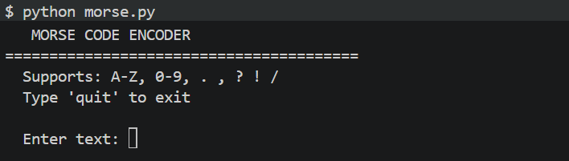
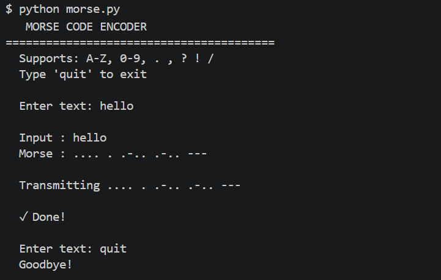

# 📡 Morse Code Encoder


A terminal-based Morse code encoder that converts any text input into real-time dot/dash patterns printed to the console along with synchronized audio beeps played through your system speaker.

Built as a coding project to explore signal timing, audio frequency generation, and the ITU Morse code standard.


## ✨ Features

- Encodes A–Z, 0–9, and punctuation (`. , ? ! /`)
- Prints dot/dash patterns to the terminal in real time, letter by letter
- Plays synchronized audio beeps at 700 Hz using ITU-standard timing
- Handles spaces between words with correct 7-unit gap timing
- Runs fully in the terminal; no GUI, no dependencies to install
- Graceful exit with `quit` or `Ctrl+C`


## 🛠️ Tech Stack

| Tool       | Purpose                                |
|------------|----------------------------------------|
| Python 3   | Core language                          |
| `winsound` | Built-in Windows audio beep generation |
| `time`     | ITU-compliant dot/dash/gap timing      |


## ⚡ Quickstart

Requirements: Python 3.x on Windows (no installs needed; uses built-in libraries only)

```bash
# Clone the repo
git clone https://github.com/YOUR_USERNAME/morse-code-encoder.git
cd morse-code-encoder

# Run
python morse.py
```

Then type any text and hit Enter.


## 📐 How It Works

Morse code encodes every character as a sequence of **dots** (short signals) and **dashes** (long signals), separated by standardized time gaps.

This project follows the **ITU Morse timing standard**:

| Element             | Duration       |
|---------------------|----------------|
| Dot                 | 1 unit (0.1s)  |
| Dash                | 3 units (0.3s) |
| Gap between symbols | 1 unit         |
| Gap between letters | 3 units        |
| Gap between words   | 7 units        |

Audio is generated using `winsound.Beep(700, duration_ms)`; a 700 Hz tone, which is the classic Morse code radio frequency.


## 🗂️ Project Structure

morse-code-encoder/

└── morse.py       --> Main encoder: dictionary, timing, audio, CLI loop


## 🔭 Planned Improvements
- Morse --> Text decoder
- Adjustable WPM (words per minute) speed
- Export audio as `.wav` file
- Cross-platform audio support (Mac/Linux)


## Screenshots





## 👩‍💻 Author

**Jessica John** 

[GitHub](https://github.com/jessicajohn23) · [LinkedIn](https://linkedin.com/in/jessicajohn07)
